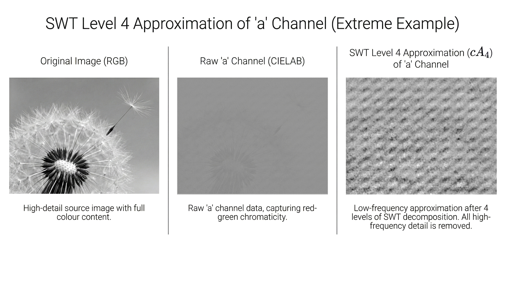

# SynthID Structural Fingerprint Detection via Frequency-Domain Feature Engineering


## Current AI Watermarking Approaches


The current AI watermarking schemes roughly fall into two categories:

- **Model-rooted methods** (e.g. Meta's Stable Signature), which modify the generative process itself. It manipulates token/denoising choices so that every sample carries a hidden code in its frequency structure.
- **Pixel-embedded methods** (e.g. Google's SynthID), which write an invisible pattern directly into the pixel or frequency domain during or immediately after generation, using a separate DL Encoder (and then Detector for detection).

Both methods promise "invisible" watermarks.

But can you inject a reliable signal into a stochastic object, such as a natural image, without measurably altering its statistics? Do you only need a proprietary, native decoder to detect the watermark, or should a sensitive, model-agnostic detector be able to pick up the trace/signature? If so how accurate?


## Project Overview


In this little project, I am testing this gap. I use only shallow frequency and texture features and a simple classifier with a fixed 0.5 decision threshold to test how far I can get in detecting modern AI watermarks (specifically SynthID from Google) without access to the underlying model or decoder.

Invisibility here is fundamentally a psychovisual feature. The pattern must bypass the Human Visual System (HVS), not a statistical test. To survive compression, rescaling, and cropping, the watermark must have strong spectral energy and structure. That must leave a statistical/spectral fingerprint.


## Human Vision or a Little Bit of Biology


The human vision is more sensitive to spatial detail in luminance than in chromaticity (e.g. hue and saturation of colour).

Neurons that carry luminance information maintain one-to-one connections with individual photoreceptors (primarily cones in the fovea). They preserve fine spatial detail when colour pathways pool signals across multiple cones to extract colour-opponent information and blur information together into a single averaged signal for the area they cover.

Fine edges, textures and sharp boundaries are encoded in the retina and primary visual cortex mainly by changes in luminance, while colour differences are added on top.

Chromatic pathways in the retina and lateral geniculate nucleus behave like low-pass filters because they pool signals across multiple cones, which allows them to detect broad colour gradients but sacrifices their ability to resolve fine spatial detail.

Psychophysical measurements of contrast sensitivity conducted in experiments clearly show this asymmetry. Observers detect luminance contrasts at much higher spatial frequencies and at much lower contrast levels than colour shift at constant brightness.

Removing some fine colour detail produces little or no perceived degradation, whereas equivalent luminance distortions are immediately visible because spatial acuity depends almost entirely on the luminance channel for humans.

To give the most illustrative example, you would still distinguish a black-and-white checkerboard pattern, even when the square size is tiny. A red-and-green checkerboard at identical brightness and spatial scale will blur into a muddy colour, because chromatic pathways cannot resolve the high-frequency pattern.

Some modern image and video systems (such as codecs) exploit this property of human perception frequently, achieving compression without perceptible quality loss.

So if you had to hide information (such as watermark), the same biology suggests a natural design choice. If the goal is to embed a signal that remains mathematically recoverable but minimally visible, then placing a significant part of it into chrominance components is attractive: perturbations there are less likely to produce salient artefacts, particularly at higher spatial frequencies.




*Figure 1: Stationary Wavelet Transform (SWT) applied to (a) channel of LAB colour space as an illustrating revealing hidden texture. Repetedly low-pass filtering and discarding high-frequency luminance detail, the watermark’s diagonal checkerboard pattern in the Green-Red channel becomes visible, even though it is imperceptible in the original image.*


## Analysis Objective

The analysis below tests to what extent such a luminance–chrominance asymmetry appears to be exploited in contemporary generative image pipelines, by examining where structured energy is injected in colour-opponent channels. 

Using hand-engineered features extracted from the CIELAB a* channel and a simple logistic regression classifier, we achieve:

- **97.7% AUC** on pristine images (clean model)
- **92.6% AUC** on degraded images (robust model)
- **100% accuracy** when robust model tested on pristine images


## Data and Sampling Strategy

This analysis is intentionally small-scale. I worked with roughly 60 images per side (SynthID-watermarked vs natural photographs), which is both a **bug and a feature**:

- It is a *bug* in the sense that you could easily throw tens of thousands of images into a deep network (e.g. a ResNet) and push the raw detection performance much much higher.
- It is a *feature* because the goal here is not to build another big black-box classifier, but to test how much of the watermark signal can be captured by **simple, interpretable features** on a constrained dataset.


To compensate for the limited number of images while keeping the model shallow and explainable, each image is split into a 4×4 grid of windows. Features are extracted per window and the classifier is trained at the window level, with predictions later aggregated back to the image level. This creates a richer training set in terms of local texture and frequency statistics, while preserving a clear, image-level interpretation of the decision.


*Figure 2. Example images from the dataset. Real JPEG photographs (left) and SynthID-watermarked generated images (right) were matched to have similar scenes and visual style. Both the training and holdout sets contain a mix of studio portraits, outdoor portraits, animals, plants, and landscapes, so the classifier cannot rely on trivial content differences.*


## Methodology

### Feature Engineering

I engineered **13 interpretable features** targeting frequency-domain patterns in the LAB a* channel:


*Figure 3: Image windowing scheme. Each image is split into 16 windows, and the classifier is trained on these window-level feature vectors as independent samples. At inference, we predict a probability for each window and then average the window probabilities to obtain a single image-level decision (post-prediction mean pooling).*

#### Feature Categories

**1. Lattice Features (6 features)** 

These look for checkerboard-like patterns by analysing energy at specific periods (2-5 pixels, focusing on high frequencies):

- `lat_diag_total_frac`: Diagonal energy fraction in frequency domain
- `lat_axis_total_frac`: Axis-aligned energy fraction  
- `lat_line_axis_density`: Density of harmonic peaks along axes
- `lat_diag_over_axis_total`: Ratio of diagonal to axis energy
- `lat_ac_var_axis_over_diag`: Autocorrelation variance ratio
- `lat_p2_fraction_of_smallperiod_energy`: Period-2 dominance


*Figure 4: Lattice features. Each image window is analysed in the frequency domain; energy at short spatial periods (2–5 px) along horizontal, vertical and diagonal directions is summarised into six features, capturing fine-scale checkerboard-like structure.*


**2. Angular Features (3 features)** 

These measure directional bias in medium-frequency **wavelet coefficients** obtained from a 2D Daubechies-4 **discrete wavelet transform (DWT)** with 3 levels on the LAB a* channel:

- `ang_entropy`: Entropy of angular energy distribution
- `ang_spectral_flatness`: Geometric/arithmetic mean ratio  
- `ang_dip_contrast`: Contrast at angular dips


*Figure 5:  A 2D Daubechies-4 DWT (3 levels) is applied to the LAB a channel, and medium-frequency detail coefficients are pooled into an angular energy histogram; three summary statistics capture how strongly energy is concentrated along specific orientations.*

**3. Diagonal Stripe Detection (1 feature)**

This feature  measures the strength of stripe-like structure at ±45° by taking the 2D autocorrelation of the window and computing the maximum absolute autocorrelation along the four diagonal directions; high values indicate strong, regularly spaced diagonal stripes (e.g. slanted watermark lines).

- `ds_autocorr_diagonal`: Maximum autocorrelation along 45° directions 


*Figure 6: Diagonal stripe detection via oriented autocorrelation. Sampling along 4 diagonal directions reveals periodic structure at 45-degree angles.*

---

**4. Quality Metrics (3 features)** - "Sanity checks"

- `snr`: Signal-to-noise ratio in dB
- `cb_confidence`: Checkerboard pattern confidence score
- `spatial_coherence`: Pattern consistency across the image


### Experimental Design

**Two models** were trained to test robustness to real-world degradations:

#### Experiment 1: Clean Model


*Figure 7. Clean watermark detection pipeline.
 The model is trained on 120 pristine(raw) images (with stratified, group-wise cross-validation that respects image identity, all windows from an image stay in the same fold) and tested on 40 clean hold-out images; each image is split into windows, classified at window level, and window probabilities are averaged to obtain the final image-level watermark score.*

**Train/Test Data:**

- 120 images (60 watermarked Gemini outputs, 60 real photographs around1400px over the longer side)
- 1,920 windows (16 per image)

**Holdout Data:**

- 40 clean holdout images (20 watermarked, 20 real)
- 640 windows

---

#### Experiment 2: Degraded Model


*Figure 8: Image degradation pipeline simulating social media compression and transformations.*


*Figure 9: Degraded watermark detection pipeline. Model trained on 720 augmented images, verified on 240 degraded holdout images.*

**Train/Test Data:**

- 720 images with 5 augmentations per base image:
  - 0.95× resize + JPEG Q80
  - 0.75× resize + JPEG Q70
  - 0.50× resize + JPEG Q70
  - ±15° rotation + JPEG Q80
  - 90-95% random crop + resize + JPEG Q80
- 11,520 windows

**Holdout Data:**

- 240 degraded holdout images (same augmentations)
- 3,840 windows


**Note on the threshold value**. *I intentionally do not optimise the threshold for each condition. On 100–200 images, that would mostly be fitting noise. Instead I fix it at 0.5 so that the differences between ‘clean-trained’ and ‘degraded-trained’ models are visible at the same operating point, and rely on AUC for threshold-free comparisons.*


**Model Configuration:**

- Classifier: Logistic Regression (C=1.0, threshold=0.5)
- Feature extraction: LAB a* channel, 4×4 grid per image
- Prediction aggregation: Window probabilities averaged to image-level

---

## Results

### Performance Summary

| Training Data | Holdout Data | AUC (training) | AUC (holdout) | Accuracy | F1 Score |
| ------------- | ------------ | -------------- | ------------- | -------- | -------- |
| Clean         | Clean        | 0.985 ± 0.031  | **0.977**     | 92.5%    | 0.919    |
| Clean         | Degraded     | 0.985 ± 0.031  | **0.683**     | 70.0%    | 0.712    |
| Degraded      | Degraded     | 0.779 ± 0.034  | **0.926**     | 90.0%    | 0.897    |
| Degraded      | Clean        | 0.779 ± 0.034  | **1.000**     | 100%     | 1.000    |

---

### Detailed Analysis by Condition

#### 1. Clean Training → Clean Holdout (Baseline)


*Figure 10: Clean model performance on pristine holdout.*

**Cross-Validation**: 0.985 ± 0.031 AUC  
**Holdout Performance**: 0.977 AUC, 92.5% accuracy

**Confusion Matrix:**

|                        | Predicted Real | Predicted Watermarked |
| ---------------------- | -------------: | --------------------: |
| **Actual Real**        |             20 |                     0 |
| **Actual Watermarked** |              3 |                    17 |


*Figure 11: Good separation of classes

Relatively good detection on raw images. 3 generated images misclassified.

---


#### 2. Clean Training → Degraded Holdout


*Figure 12: Clean model fails on degraded data. AUC drops 30% to 0.683.*

**Holdout Performance**: 0.683 AUC (↓29.4%), 70.0% accuracy

**Confusion Matrix:**

|                        | Predicted Real | Predicted Watermarked |
| ---------------------- | -------------: | --------------------: |
| **Actual Real**        |             79 |                    41 |
| **Actual Watermarked** |             31 |                    89 |

Dramatic performance decline. 

- **34% false positive rate** (41/120 real images flagged)
- **26% false negative rate** (31/120 watermarked images missed)

JPEG compression and mild geometric transforms (rescaling, rotation, cropping) blur, quantise, or reorient these high-frequency components, effectively flattening the angular energy histogram. Once those directional cues are destroyed, the classifier is left with only weak, non-discriminative signals, so the decision boundary learned on raw data no longer matches the degraded images.

---

#### 3. Degraded Training → Degraded holdout(Robust Performance)


*Figure 13: Degraded model maintains high performance on attacked images. 92.6% AUC with balanced errors.*

**Cross-Validation**: 0.779 ± 0.034 AUC  
**Holdout Performance**: 0.926 AUC (↑35% vs clean-trained), 90.0% accuracy

**Confusion Matrix:**

|                        | Predicted Real | Predicted Watermarked |
| ---------------------- | -------------: | --------------------: |
| **Actual Real**        |            112 |                     8 |
| **Actual Watermarked** |             16 |                   104 |

**Analysis**: Training on augmented data produces robust detection:

- **6.7% false positive rate** (8/120)
- **13.3% false negative rate** (16/120)
- Maintains ok performance despite compression, resizing, rotation, and cropping

---

#### 4. Degraded Training → Clean holdout


*Figure 14: Degraded model achieves perfect 100% accuracy on raw images, outperforming the clean-trained baseline.*

**Holdout Performance**: 1.000 AUC, 100% accuracy, 1.000 F1

**Confusion Matrix:**

|                        | Predicted Real | Predicted Watermarked |
| ---------------------- | -------------: | --------------------: |
| **Actual Real**        |             20 |                     0 |
| **Actual Watermarked** |              0 |                    20 |


*Figure 15: Cleaner separation than clean-trained model. All images correctly classified with high confidence.*

The degraded-trained model achieves better accuracy on clean images, outperforming the clean-trained baseline (92.5%). 

---

### Feature Importance Analysis

The two models rely on different feature sets:

#### Clean-Trained Model


*Figure 16: Clean model heavily weights angular features (coefficients >5.0)*

**Top 5 Features:**

| Feature                 | Coefficient | Type    |
| ----------------------- | ----------: | ------- |
| `ang_entropy`           |       -5.49 | Angular |
| `ang_dip_contrast`      |       -4.50 | Angular |
| `ang_spectral_flatness` |       +4.19 | Angular |
| `lat_diag_total_frac`   |       +2.05 | Lattice |
| `lat_axis_total_frac`   |       -1.92 | Lattice |

**Pattern**: High dependence on **angular features** (wavelet-based directional analysis)

---

#### Degraded-Trained Model


*Figure 17: Degraded model uses balanced features (coefficients <2.5) with emphasis on robust frequency-domain patterns.*

**Top 5 Features:**

| Feature                 | Coefficient | Type    |
| ----------------------- | ----------: | ------- |
| `ang_spectral_flatness` |       +2.07 | Angular |
| `lat_axis_total_frac`   |       -0.74 | Lattice |
| `lat_diag_total_frac`   |       +0.50 | Lattice |
| `snr`                   |       +0.45 | Quality |
| `ang_entropy`           |       -0.44 | Angular |


---

## Summary

1. **SynthID watermarks are detectable** using frequency-domain features from the LAB a* channel, without access to Google's proprietary detector or keys.

2. **The watermark signal is robust and likely holographic**: It survives JPEG compression (Q70-80), resizing (down to 50%), rotation (±15°), and cropping (90-95%), maintaining 90% detection accuracy.

3. **Training data quality matters more than model complexity**: A simple logistic regression on augmented data outperforms the same model trained on raw images (0.93 vs 0.68 AUC) when tested on real-world conditions.

4. **Pristine training creates brittle detectors**: Models trained on clean data fail badly on degraded images (30% AUC drop), despite excellent performance on clean data.

5. **Augmentation produces superior generalization**: Training on degraded data yields a model that:
   - Maintains 90% accuracy on degraded images
   - Achieves **100% accuracy** on clean images (better than clean-trained baseline)
   - Uses balanced, robust features rather than fragile directional artifacts

6. **Real-world deployment requires realistic training data**: For production systems where compression and transformations are ubiquitous, models **must** be trained on augmented data reflecting expected quality variations.

---

## Implementation

### Core Modules

```
├── feature_extractor.py          # 13-feature extraction pipeline
├── parallelised_feature_pipeline.py  # Parallel batch processing
└── balanced_classifier.py        # Training, CV, and evaluation
```

### Feature Extraction

```python
from feature_extractor import WindowFeatureExtractor

extractor = WindowFeatureExtractor()
features = extractor.extract_all(window)  # Returns dict with 13 features
```

### Training Pipeline

```bash
# Extract features from images
python parallelised_feature_pipeline.py \
    --input_folder ./images/watermarked \
    --output ./features_watermarked.csv \
    --channel a_lab \
    --label watermarked

# Train classifier with cross-validation
python balanced_classifier.py \
    --mode train \
    --input features_combined.csv \
    --output model_output \
    --n_splits 5
```

### Requirements

```
numpy
scipy
opencv-python (cv2)
pywt (PyWavelets)
scikit-learn
pandas
matplotlib
seaborn
joblib
```

---

## Limitations

1. **Small-scale study**: Only 120 base training images per model. Larger datasets would improve robustness estimates, different images may produce different results. 
2. **Single watermarking system**: Tested only on Google's SynthID. Generalisation to other watermarking schemes unknown.
3. **Static augmentation**: Degradation pipeline simulates common transformations but may not cover all real-world attack scenarios.
4. **Frequency-domain focus**: Features target spectral patterns. Learned features might capture additional signal.
5. **Binary classification**: Does not provide watermark payload extraction or multi-class discrimination between watermarking methods.

---

## Repository Structure

```
.
├── README.md                           
├── feature_extractor.py                # Core feature extraction (13 features)
├── parallelised_feature_pipeline.py    # Batch processing pipeline
├── balanced_classifier.py              # Training and evaluation
└── assets/                             # Visuals for the README
    ├── dataset_examples.png
    └── ...                             


```


------

## Conclusion


These experiments are consistent with SynthID behaving like a holographic watermark in the image domain:

- The watermark signal appears distributed across the entire image texture, not being present in a specific region.
- Window-level features in the LAB a* channel remain discriminative even after cropping, resizing, and rotation, as long as enough texture remains.
- Training on degraded images leads to a detector that:
- Maintains **90% accuracy** under JPEG compression, downscaling and some cropping
- Achieves **100% accuracy** on raw images using the *same* fixed 0.5 threshold

One of the main properties of such a design is robustness to cropping. A watermark is "everywhere" in the texture, and should survive cutting the image in half, or taking a piece of it, and it will still be detectable.

My results, together with exploratory SWT/DST visualisations, are consistent with the idea that the SynthID leaves a signal in the a* channel, a repeated fingerprint that remains recoverable even after substantial geometric and compression distortions.

That being said, this setup cannot prove that SynthID is *exactly* a holographic watermark in the formal sense, nor can it guarantee that the features are picking up only the watermark structure and nothing else. 

- The dataset is small and based on one public source of SynthID-marked images plus a limited set of real photographs.
- The feature set is hand-crafted and narrow (frequency/texture in LAB a*); other watermark cues may exist outside this space.

Images generated with Stable Diffusion *without* SynthID and without the invisible SD watermark did not exhibit the same structural fingerprint as the Nano Banana SynthID images, under the same feature extractor and classifier. It makes it less likely that the detector is simply learning a trivial artefact of the diffusion model's underlying upsampling.


---

## Ethical Considerations

This research is conducted for academic purposes to understand watermarking robustness. The techniques demonstrated:

- **Do not remove or forge watermarks**

- **Do not enable malicious use** of generated content

- **Highlight the importance of robust watermarking** in AI systems

- **Demonstrate that security through obscurity is insufficient** for watermark protection

  

---

## License

MIT License - See LICENSE file for details

---

## Acknowledgments

- Google DeepMind for making SynthID-watermarked images publicly available via Gemini
- The open-source computer vision and signal processing communities
- Special thanks to "Nano Banana" for the pipeline visualization diagrams! 

---

**Contact**: Victoria Titova

**Last Updated**: November 2025


